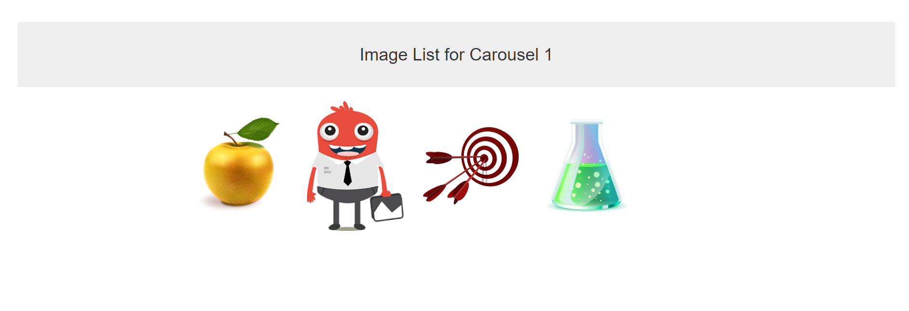

This is Node.js server that serves images from postgresql database for a given carousel. 

The running example can be seen at  https://crsl-imglist.herokuapp.com/1, 
                                    https://crsl-imglist.herokuapp.com/2,
                                    https://crsl-imglist.herokuapp.com/3
for the 3 carousels. 

To retrieve the image sources, server connects to postgresql tables "Carousel" and "Images". 
The image sources are saved as base64 format in table "Images".


"Image" table contains following fields: "img_id", "img_crsl_id", "img_src"
"Carousel" table contains following fields: "crsl_id", "crsl_name".


The API for getting images works at https://serveraddress:port/:id (id of the caorousel). In this example, 3 carousels with 4, 3, 3, images
respectively. 

If you want to run the project local please install all modules by running
```
npm i
```
and make sure you have the corresponding tables with appropriate fields as written above.


